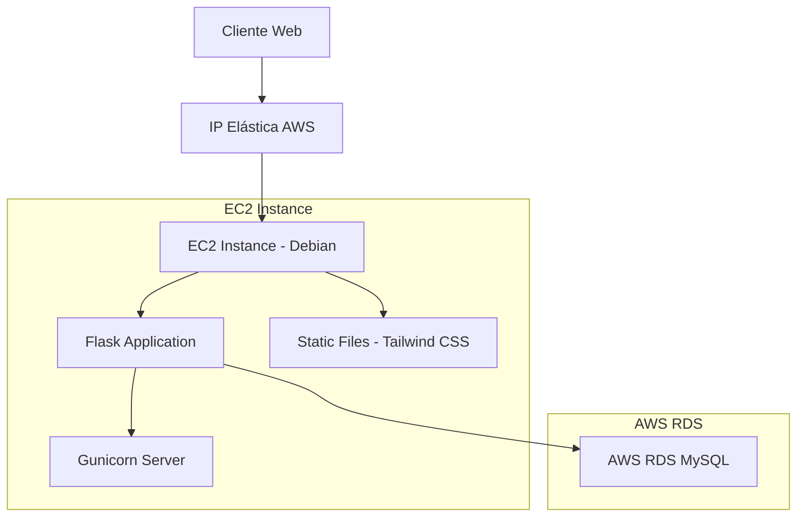

# 🚀 Despliegue de Aplicación Web en AWS EC2 con IP Estática

## 📋 Tabla de Contenidos
- [Descripción del Proyecto](#-descripción-del-proyecto)
- [Arquitectura del Sistema](#-arquitectura-del-sistema)
- [Tecnologías Utilizadas](#-tecnologías-utilizadas)
- [Requisitos Previos](#-requisitos-previos)
- [Configuración del Entorno](#-configuración-del-entorno)
- [Instalación y Configuración](#-instalación-y-configuración)
- [Estructura del Proyecto](#-estructura-del-proyecto)
- [Despliegue en AWS EC2](#-despliegue-en-aws-ec2)
- [Configuración de Base de Datos](#-configuración-de-base-de-datos)
- [Configuración de Tailwind CSS](#-configuración-de-tailwind-css)
- [Subir Proyecto a GitHub](#-subir-proyecto-a-github)
- [Solución de Problemas](#-solución-de-problemas)
- [Mantenimiento](#-mantenimiento)

---

## 🎯 Descripción del Proyecto

Este proyecto implementa una aplicación web completa desplegada en AWS EC2 con conexión a base de datos RDS MySQL, utilizando Flask como backend y Tailwind CSS para el frontend. La aplicación cuenta con IP elástica para acceso público estable.

### Características Principales
- ✅ Backend robusto con Python Flask
- ✅ Frontend responsivo con Tailwind CSS
- ✅ Base de datos MySQL en AWS RDS
- ✅ Despliegue en EC2 con IP elástica
- ✅ Entorno virtual aislado
- ✅ Servidor de producción con Gunicorn

---

## 🏗️ Arquitectura del Sistema



---

## 🛠️ Tecnologías Utilizadas

| Categoría | Tecnología | Versión | Propósito |
|-----------|------------|---------|-----------|
| **Backend** | Python | 3.9+ | Lenguaje principal |
| **Framework** | Flask | 2.3.0 | Servidor web |
| **Frontend** | HTML5 | - | Estructura |
| **Estilos** | Tailwind CSS | 3.x | Framework CSS |
| **Base de Datos** | MySQL | 8.0+ | Almacenamiento |
| **Servidor** | Gunicorn | 21.2.0 | WSGI Server |
| **Cloud** | AWS EC2 | - | Hosting |
| **Cloud** | AWS RDS | - | Base de datos |
| **SO** | Debian | 11+ | Sistema operativo |

---

## 📋 Requisitos Previos

### En tu máquina local:
- [ ] Node.js 16+ instalado
- [ ] Git configurado
- [ ] PuTTY (Windows) o SSH client
- [ ] Cuenta de AWS activa

### En AWS:
- [ ] Instancia EC2 creada (Debian)
- [ ] Instancia RDS MySQL configurada
- [ ] IP Elástica asignada
- [ ] Security Groups configurados

---

## ⚙️ Configuración del Entorno

### 🔐 Conexión a EC2 usando PuTTY

#### Paso 1: Convertir llave .pem a .ppk
```bash
# Usar PuTTYgen para convertir
# 1. Abrir PuTTYgen
# 2. Load -> Seleccionar archivo .pem
# 3. Save private key -> Guardar como .ppk
```

#### Paso 2: Configurar PuTTY
```
Host Name: admin@54.156.54.245
Port: 22
Connection type: SSH
Auth: Cargar archivo .ppk generado
```

### 🖥️ Configuración Inicial del Servidor

```bash
# Actualizar sistema
sudo apt update && sudo apt upgrade -y

# Instalar dependencias
sudo apt install python3-pip python3-venv git -y
sudo apt install python3-distutils -y

# Verificar instalación
python3 --version
pip3 --version
git --version
```

---

## 📦 Instalación y Configuración

### 1. Clonar y Configurar Proyecto

```bash
# Clonar repositorio
git clone https://github.com/tuusuario/tuproyecto.git
cd tuproyecto

# Crear entorno virtual
python3 -m venv venv

# Activar entorno virtual
source venv/bin/activate

# Instalar dependencias
pip install -r requirements.txt
```

### 2. Configurar Variables de Entorno

```bash
# Crear archivo .env
nano .env
```

```env
# Configuración de Base de Datos
DB_HOST=tareafinal.cjcko4j36hk3.us-east-1.rds.amazonaws.com
DB_USER=admin
DB_PASSWORD=admin2025
DB_NAME=Tarea

# Configuración de Flask
FLASK_ENV=production
FLASK_DEBUG=False
SECRET_KEY=tu_clave_secreta_aqui
```

---

## 📁 Estructura del Proyecto

```
proyecto/
├── 📄 app.py                 # Aplicación principal Flask
├── 📄 requirements.txt       # Dependencias Python
├── 📄 .env                   # Variables de entorno
├── 📄 README.md             # Documentación
├── 📁 templates/            # Plantillas HTML
│   └── 📄 index.html
├── 📁 static/               # Archivos estáticos
│   ├── 📁 css/
│   │   ├── 📄 input.css     # CSS fuente Tailwind
│   │   └── 📄 tailwind.css  # CSS compilado
│   └── 📁 js/
│       └── 📄 main.js       # JavaScript principal
└── 📁 venv/                 # Entorno virtual
```

---

## 🔧 Archivos de Configuración

### requirements.txt
```txt
Flask==2.3.0
mysql-connector-python==8.0.33
gunicorn==21.2.0
python-dotenv==1.0.0
```

### app.py
```python
from flask import Flask, render_template, jsonify
import mysql.connector
import os
from dotenv import load_dotenv

# Cargar variables de entorno
load_dotenv()

app = Flask(__name__)
app.secret_key = os.getenv('SECRET_KEY', 'dev-key')

# Configuración de la base de datos
db_config = {
    "host": os.getenv('DB_HOST'),
    "user": os.getenv('DB_USER'),
    "password": os.getenv('DB_PASSWORD'),
    "database": os.getenv('DB_NAME')
}

@app.route('/')
def home():
    """Página principal de la aplicación"""
    return render_template('index.html')

@app.route('/test-db')
def test_db():
    """Endpoint para probar conexión a la base de datos"""
    try:
        conn = mysql.connector.connect(**db_config)
        cursor = conn.cursor()
        cursor.execute("SELECT VERSION()")
        version = cursor.fetchone()
        cursor.close()
        conn.close()
        
        return jsonify({
            "status": "success", 
            "version": version[0],
            "message": "Conexión exitosa a la base de datos"
        })
    except Exception as e:
        return jsonify({
            "status": "error", 
            "message": str(e)
        }), 500

@app.route('/health')
def health_check():
    """Endpoint de salud para monitoreo"""
    return jsonify({
        "status": "healthy",
        "service": "Flask App",
        "version": "1.0.0"
    })

if __name__ == '__main__':
    app.run(host='0.0.0.0', port=5000, debug=False)
```

### templates/index.html
```html
<!DOCTYPE html>
<html lang="es">
<head>
    <meta charset="UTF-8">
    <meta name="viewport" content="width=device-width, initial-scale=1.0">
    <title>Flask + Tailwind CSS + AWS RDS</title>
    <link href="/static/css/tailwind.css" rel="stylesheet">
    <link rel="icon" type="image/x-icon" href="/static/favicon.ico">
</head>
<body class="bg-gradient-to-br from-pink-50 via-purple-50 to-indigo-100 min-h-screen flex items-center justify-center px-4">
    
    <!-- Contenedor Principal -->
    <div class="max-w-lg w-full bg-white shadow-xl rounded-2xl p-8 text-center transform hover:scale-105 transition-transform duration-300">
        
        <!-- Header -->
        <div class="mb-6">
            <h1 class="text-4xl font-extrabold text-gray-900 mb-2">¡Hola! 👋</h1>
            <div class="w-20 h-1 bg-gradient-to-r from-pink-500 to-purple-600 mx-auto rounded-full"></div>
        </div>
        
        <!-- Descripción -->
        <p class="text-lg text-gray-700 mb-8 leading-relaxed">
            Esta es mi aplicación <span class="font-semibold text-pink-600">Flask</span> 
            con <span class="font-semibold text-purple-600">Tailwind CSS</span> 
            y conexión a una base de datos remota en 
            <span class="font-semibold text-blue-600">AWS RDS</span>.
        </p>

        <!-- Botón de Prueba -->
        <button id="test-btn"
                class="px-8 py-4 bg-gradient-to-r from-pink-500 to-purple-600 hover:from-purple-600 hover:to-pink-500 text-white font-medium rounded-xl shadow-lg transition-all duration-300 transform hover:scale-105 focus:outline-none focus:ring-4 focus:ring-purple-300">
            🧪 Probar conexión a la BD
        </button>

        <!-- Resultado de la Prueba -->
        <div id="db-result" class="mt-8 p-4 bg-gray-50 rounded-xl text-left text-sm space-y-3 hidden">
            <div class="flex items-center justify-between">
                <span class="font-medium text-gray-700">Estado:</span>
                <span id="status" class="px-3 py-1 rounded-full text-xs font-medium"></span>
            </div>
            <div class="flex items-center justify-between">
                <span class="font-medium text-gray-700">Versión MySQL:</span>
                <span id="version" class="font-mono text-blue-600"></span>
            </div>
            <div id="message" class="text-center p-3 rounded-lg font-medium"></div>
        </div>

        <!-- Footer -->
        <footer class="mt-8 pt-6 border-t border-gray-200">
            <p class="text-xs text-gray-400">
                &copy; 2025 - Hecho con ❤️ usando Flask, Tailwind CSS y AWS RDS
            </p>
            <div class="flex justify-center space-x-4 mt-2">
                <span class="text-xs bg-pink-100 text-pink-600 px-2 py-1 rounded">Flask</span>
                <span class="text-xs bg-purple-100 text-purple-600 px-2 py-1 rounded">Tailwind</span>
                <span class="text-xs bg-blue-100 text-blue-600 px-2 py-1 rounded">AWS</span>
            </div>
        </footer>
    </div>

    <!-- Scripts -->
    <script src="/static/js/main.js"></script>
</body>
</html>
```

### static/js/main.js
```javascript
/**
 * Aplicación principal - Manejo de eventos y API calls
 */
document.addEventListener('DOMContentLoaded', () => {
    initializeApp();
});

/**
 * Inicializa la aplicación
 */
function initializeApp() {
    const testButton = document.getElementById('test-btn');
    
    if (!testButton) {
        console.error('Botón de prueba no encontrado');
        return;
    }

    testButton.addEventListener('click', handleDatabaseTest);
    
    // Agregar indicador de carga
    testButton.addEventListener('click', () => {
        showLoadingState(testButton);
    });
}

/**
 * Maneja la prueba de conexión a la base de datos
 */
async function handleDatabaseTest() {
    const button = document.getElementById('test-btn');
    const originalText = button.innerHTML;
    
    try {
        // Mostrar estado de carga
        button.innerHTML = '⏳ Conectando...';
        button.disabled = true;
        
        const response = await fetch('/test-db');
        const data = await response.json();
        
        displayDatabaseResult(data);
        
    } catch (error) {
        console.error('Error al probar conexión:', error);
        displayDatabaseResult({
            status: 'error',
            message: '⚠️ Error al realizar la solicitud.'
        });
    } finally {
        // Restaurar botón
        button.innerHTML = originalText;
        button.disabled = false;
    }
}

/**
 * Muestra el resultado de la prueba de base de datos
 * @param {Object} data - Datos de respuesta del servidor
 */
function displayDatabaseResult(data) {
    const resultDiv = document.getElementById('db-result');
    const statusSpan = document.getElementById('status');
    const versionSpan = document.getElementById('version');
    const messageDiv = document.getElementById('message');

    if (data.status === 'success') {
        statusSpan.textContent = 'Conectado';
        statusSpan.className = 'px-3 py-1 rounded-full text-xs font-medium bg-green-100 text-green-800';
        
        versionSpan.textContent = data.version || 'N/A';
        
        messageDiv.textContent = '✅ ¡Conexión establecida correctamente!';
        messageDiv.className = 'text-center p-3 rounded-lg font-medium bg-green-100 text-green-700';
        
    } else {
        statusSpan.textContent = 'Error';
        statusSpan.className = 'px-3 py-1 rounded-full text-xs font-medium bg-red-100 text-red-800';
        
        versionSpan.textContent = 'N/A';
        
        messageDiv.textContent = data.message || '❌ No se pudo conectar a la base de datos.';
        messageDiv.className = 'text-center p-3 rounded-lg font-medium bg-red-100 text-red-700';
    }

    // Mostrar resultado con animación
    resultDiv.classList.remove('hidden');
    resultDiv.style.opacity = '0';
    resultDiv.style.transform = 'translateY(10px)';
    
    setTimeout(() => {
        resultDiv.style.transition = 'all 0.3s ease';
        resultDiv.style.opacity = '1';
        resultDiv.style.transform = 'translateY(0)';
    }, 100);
}

/**
 * Muestra estado de carga en un botón
 * @param {HTMLElement} button - Elemento botón
 */
function showLoadingState(button) {
    button.classList.add('animate-pulse');
    
    setTimeout(() => {
        button.classList.remove('animate-pulse');
    }, 2000);
}

/**
 * Utilidades generales
 */
const Utils = {
    /**
     * Formatea fecha a string legible
     * @param {Date} date - Fecha a formatear
     * @returns {string} Fecha formateada
     */
    formatDate: (date) => {
        return new Intl.DateTimeFormat('es-ES', {
            year: 'numeric',
            month: 'long',
            day: 'numeric',
            hour: '2-digit',
            minute: '2-digit'
        }).format(date);
    },

    /**
     * Muestra notificación toast
     * @param {string} message - Mensaje a mostrar
     * @param {string} type - Tipo de notificación (success, error, info)
     */
    showToast: (message, type = 'info') => {
        // Implementación de toast notifications
        console.log(`[${type.toUpperCase()}] ${message}`);
    }
};
```

---

## 🎨 Configuración de Tailwind CSS

### Instalación Local

```bash
# En tu máquina local, crear directorio del proyecto
mkdir mi-proyecto-flask
cd mi-proyecto-flask

# Inicializar npm
npm init -y

# Instalar Tailwind CSS
npm install -D tailwindcss postcss autoprefixer

# Inicializar configuración
npx tailwindcss init
```

### tailwind.config.js
```javascript
/** @type {import('tailwindcss').Config} */
module.exports = {
  content: [
    "./templates/**/*.html",
    "./static/js/**/*.js"
  ],
  theme: {
    extend: {
      colors: {
        primary: {
          50: '#fdf2f8',
          500: '#ec4899',
          600: '#db2777',
          700: '#be185d',
        },
        secondary: {
          50: '#f8fafc',
          500: '#64748b',
          600: '#475569',
          700: '#334155',
        }
      },
      fontFamily: {
        sans: ['Inter', 'system-ui', 'sans-serif'],
      },
      animation: {
        'fade-in': 'fadeIn 0.5s ease-in-out',
        'slide-up': 'slideUp 0.3s ease-out',
      }
    },
  },
  plugins: [
    require('@tailwindcss/forms'),
    require('@tailwindcss/typography'),
  ],
}
```

### static/css/input.css
```css
@tailwind base;
@tailwind components;
@tailwind utilities;

/* Componentes personalizados */
@layer components {
  .btn-primary {
    @apply px-6 py-3 bg-gradient-to-r from-pink-500 to-purple-600 text-white font-medium rounded-lg shadow-md hover:shadow-lg transform hover:scale-105 transition-all duration-300;
  }
  
  .card {
    @apply bg-white rounded-xl shadow-lg p-6 hover:shadow-xl transition-shadow duration-300;
  }
  
  .input-field {
    @apply w-full px-4 py-3 border border-gray-300 rounded-lg focus:ring-2 focus:ring-purple-500 focus:border-transparent transition-all duration-200;
  }
}

/* Animaciones personalizadas */
@keyframes fadeIn {
  from { opacity: 0; transform: translateY(20px); }
  to { opacity: 1; transform: translateY(0); }
}

@keyframes slideUp {
  from { transform: translateY(100%); }
  to { transform: translateY(0); }
}

/* Utilidades adicionales */
@layer utilities {
  .text-gradient {
    @apply bg-gradient-to-r from-pink-500 to-purple-600 bg-clip-text text-transparent;
  }
  
  .glass-effect {
    @apply bg-white bg-opacity-20 backdrop-blur-lg border border-white border-opacity-30;
  }
}
```

### Compilar Tailwind CSS
```bash
# Compilación única
npx tailwindcss -i ./static/css/input.css -o ./static/css/tailwind.css

# Compilación con watch (desarrollo)
npx tailwindcss -i ./static/css/input.css -o ./static/css/tailwind.css --watch

# Compilación para producción (minificado)
npx tailwindcss -i ./static/css/input.css -o ./static/css/tailwind.css --minify
```

---

## 🚀 Despliegue en AWS EC2

### 1. Ejecutar la Aplicación

```bash
# Activar entorno virtual
source venv/bin/activate

# Ejecutar con Flask (desarrollo)
python app.py

# Ejecutar con Gunicorn (producción)
gunicorn --bind 0.0.0.0:5000 --workers 3 app:app

# Ejecutar en segundo plano
nohup gunicorn --bind 0.0.0.0:5000 --workers 3 app:app > app.log 2>&1 &
```

### 2. Configurar Servicio Systemd

```bash
# Crear archivo de servicio
sudo nano /etc/systemd/system/flask-app.service
```

```ini
[Unit]
Description=Flask Application
After=network.target

[Service]
Type=simple
User=admin
WorkingDirectory=/home/admin/tuproyecto
Environment=PATH=/home/admin/tuproyecto/venv/bin
ExecStart=/home/admin/tuproyecto/venv/bin/gunicorn --bind 0.0.0.0:5000 --workers 3 app:app
Restart=always
RestartSec=3

[Install]
WantedBy=multi-user.target
```

```bash
# Habilitar y iniciar servicio
sudo systemctl daemon-reload
sudo systemctl enable flask-app
sudo systemctl start flask-app

# Verificar estado
sudo systemctl status flask-app
```

### 3. Configurar Nginx (Opcional)

```bash
# Instalar Nginx
sudo apt install nginx -y

# Configurar sitio
sudo nano /etc/nginx/sites-available/flask-app
```

```nginx
server {
    listen 80;
    server_name 54.156.54.245;

    location / {
        proxy_pass http://127.0.0.1:5000;
        proxy_set_header Host $host;
        proxy_set_header X-Real-IP $remote_addr;
        proxy_set_header X-Forwarded-For $proxy_add_x_forwarded_for;
        proxy_set_header X-Forwarded-Proto $scheme;
    }

    location /static {
        alias /home/admin/tuproyecto/static;
        expires 1y;
        add_header Cache-Control "public, immutable";
    }
}
```

```bash
# Habilitar sitio
sudo ln -s /etc/nginx/sites-available/flask-app /etc/nginx/sites-enabled/
sudo nginx -t
sudo systemctl restart nginx
```

---

## 🗄️ Configuración de Base de Datos

### Conexión a RDS MySQL

```python
# Configuración segura de conexión
import mysql.connector
from mysql.connector import Error
import os

class DatabaseManager:
    def __init__(self):
        self.config = {
            'host': os.getenv('DB_HOST'),
            'user': os.getenv('DB_USER'),
            'password': os.getenv('DB_PASSWORD'),
            'database': os.getenv('DB_NAME'),
            'port': 3306,
            'charset': 'utf8mb4',
            'use_unicode': True,
            'autocommit': True
        }
    
    def get_connection(self):
        """Obtiene conexión a la base de datos"""
        try:
            connection = mysql.connector.connect(**self.config)
            if connection.is_connected():
                return connection
        except Error as e:
            print(f"Error conectando a MySQL: {e}")
            return None
    
    def execute_query(self, query, params=None):
        """Ejecuta una consulta SQL"""
        connection = self.get_connection()
        if connection:
            try:
                cursor = connection.cursor(dictionary=True)
                cursor.execute(query, params)
                result = cursor.fetchall()
                return result
            except Error as e:
                print(f"Error ejecutando consulta: {e}")
                return None
            finally:
                if connection.is_connected():
                    cursor.close()
                    connection.close()
```

### Scripts SQL de Inicialización

```sql
-- Crear base de datos
CREATE DATABASE IF NOT EXISTS Tarea 
CHARACTER SET utf8mb4 
COLLATE utf8mb4_unicode_ci;

USE Tarea;

-- Tabla de usuarios
CREATE TABLE IF NOT EXISTS usuarios (
    id INT AUTO_INCREMENT PRIMARY KEY,
    nombre VARCHAR(100) NOT NULL,
    email VARCHAR(255) UNIQUE NOT NULL,
    fecha_creacion TIMESTAMP DEFAULT CURRENT_TIMESTAMP,
    activo BOOLEAN DEFAULT TRUE
);

-- Insertar datos de prueba
INSERT INTO usuarios (nombre, email) VALUES 
('Juan Pérez', 'juan@example.com'),
('María García', 'maria@example.com'),
('Carlos López', 'carlos@example.com');

-- Verificar datos
SELECT * FROM usuarios;
```

---

## 📤 Subir Proyecto a GitHub

### 1. Configuración Inicial de Git

```bash
# Configurar Git globalmente
git config --global user.name "tu-nombre-usuario"
git config --global user.email "tu-email@example.com"

# Verificar configuración
git config --list
```

### 2. Crear Token de Acceso Personal

1. Ve a GitHub → **Settings** → **Developer settings**
2. Selecciona **Personal access tokens** → **Tokens (classic)**
3. Clic en **Generate new token (classic)**
4. Selecciona permisos: `repo`, `write:repo_hook`, `read:user`
5. Genera y copia el token inmediatamente

### 3. Inicializar Repositorio Local

```bash
# Crear .gitignore
cat > .gitignore << EOF
# Python
__pycache__/
*.py[cod]
*$py.class
*.so
venv/
env/
.env

# IDEs
.vscode/
.idea/
*.swp
*.swo

# OS
.DS_Store
Thumbs.db

# Logs
*.log
logs/

# Node modules (si usas npm)
node_modules/
package-lock.json

# Tailwind
static/css/tailwind.css.map
EOF

# Inicializar repositorio
git init
git add .
git commit -m "🚀 Versión inicial: Flask + Tailwind CSS + AWS RDS"
```

### 4. Conectar con GitHub

```bash
# Agregar repositorio remoto
git remote add origin https://github.com/tu-usuario/tu-repositorio.git

# Verificar conexión
git remote -v

# Subir código
git branch -M main
git push -u origin main
```

### 5. Comandos Git Útiles

```bash
# Ver estado del repositorio
git status

# Agregar cambios específicos
git add archivo.py
git add static/css/

# Commit con mensaje descriptivo
git commit -m "✨ Agregar funcionalidad de conexión DB"

# Subir cambios
git push

# Ver historial
git log --oneline

# Crear nueva rama
git checkout -b feature/nueva-funcionalidad

# Cambiar entre ramas
git checkout main
git checkout feature/nueva-funcionalidad

# Fusionar rama
git checkout main
git merge feature/nueva-funcionalidad
```

---

## 🔧 Solución de Problemas

### Problemas Comunes y Soluciones

| Problema | Síntoma | Solución |
|----------|---------|----------|
| **Puerto no accesible** | `Connection refused` | Verificar Security Group en EC2 |
| **Error de conexión DB** | `Can't connect to MySQL` | Revisar credenciales y Security Group RDS |
| **Tailwind no carga** | Estilos no aplicados | Verificar ruta del archivo CSS compilado |
| **App se cierra** | Proceso termina al cerrar SSH | Usar `nohup`, `screen` o `systemd` |
| **Error 500** | Internal Server Error | Revisar logs: `tail -f app.log` |

### Comandos de Diagnóstico

```bash
# Verificar puertos abiertos
sudo netstat -tlnp | grep :5000

# Ver logs de la aplicación
tail -f app.log
tail -f /var/log/nginx/error.log

# Verificar estado del servicio
sudo systemctl status flask-app

# Probar conexión a RDS
telnet tareafinal.cjcko4j36hk3.us-east-1.rds.amazonaws.com 3306

# Verificar variables de entorno
printenv | grep DB_

# Monitorear recursos del sistema
htop
df -h
free -h
```

### Logs y Monitoreo

```bash
# Configurar logging en Flask
import logging
from logging.handlers import RotatingFileHandler

if not app.debug:
    file_handler = RotatingFileHandler('logs/app.log', maxBytes=10240, backupCount=10)
    file_handler.setFormatter(logging.Formatter(
        '%(asctime)s %(levelname)s: %(message)s [in %(pathname)s:%(lineno)d]'
    ))
    file_handler.setLevel(logging.INFO)
    app.logger.addHandler(file_handler)
    app.logger.setLevel(logging.INFO)
    app.logger.info('Flask app startup')
```

---

## 🔄 Mantenimiento

### Actualizaciones del Sistema

```bash
# Actualizar paquetes del sistema
sudo apt update && sudo apt upgrade -y

# Actualizar dependencias Python
source venv/bin/activate
pip list --outdated
pip install --upgrade package_name

# Regenerar requirements.txt
pip freeze > requirements.txt
```

### Backup y Restauración

```bash
# Backup de la aplicación
tar -czf backup-$(date +%Y%m%d).tar.gz tuproyecto/

# Backup de base de datos
mysqldump -h tareafinal.cjcko4j36hk3.us-east-1.rds.amazonaws.com \
          -u admin -p Tarea > backup-db-$(date +%Y%m%d).sql
```

### Monitoreo de Performance

```bash
# Script de monitoreo simple
#!/bin/bash
echo "=== Estado del Sistema ===" >> monitor.log
date >> monitor.log
echo "CPU y Memoria:" >> monitor.log
top -bn1 | grep "Cpu\|Mem" >> monitor.log
echo "Espacio en disco:" >> monitor.log
df -h >> monitor.log
echo "Estado de la aplicación:" >> monitor.log
curl -s http://localhost:5000/health >> monitor.log
echo "=========================" >> monitor.log
```

---

## 📞 Soporte y Contacto

- **Documentación**: Este README.md
- **Issues**: Crear issue en el repositorio de GitHub
- **Email**: tu-email@example.com

---

## 📄 Licencia

Este proyecto está bajo la Licencia MIT. Ver el archivo `LICENSE` para más detalles.

---

**¡Gracias por usar este proyecto! 🚀**

*Desarrollado con ❤️ usando Flask, Tailwind CSS y AWS*
